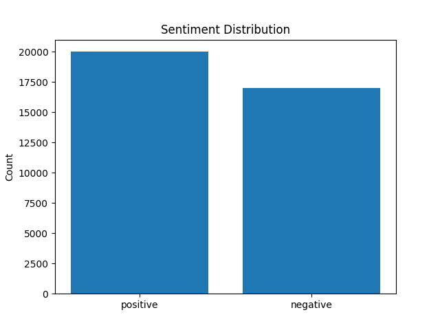
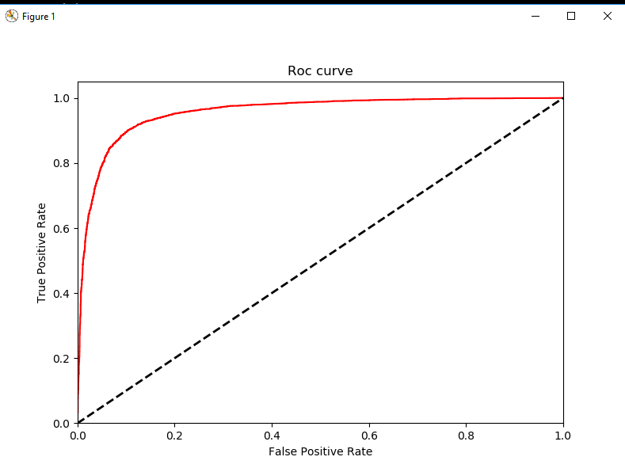
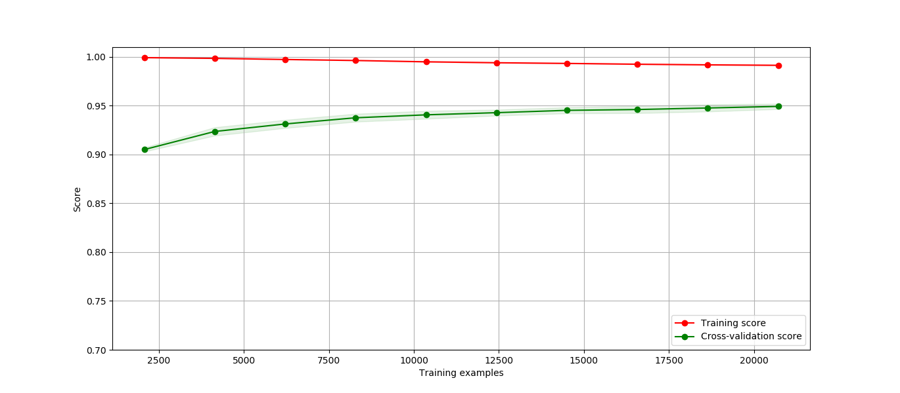

## Sentiment Classfication using Support Vector Machine
This project classifies reviews into positive or negative sentiment. A model is developed based on Support Vector Machine(SVM). Reviews of Baby products, obtained from [Amazon Product Reviews Dataset](http://jmcauley.ucsd.edu/data/amazon/), is used to train `SVM`. 
### Objective
- To classify reviews into positive or negative

## Installation
* I recommend to use `virtualenv`
* Install dependencies using `requirements.txt` file. 
* go to directory `project-root` and run following command
>`pip install -r requirements.txt`
* In addition to this, you need to download some data (`punkt`, `stopworkds`) of `nltk` module, for this, just run following command
>`python nltk_setup.py`
### How to run trained Model ?

There is file `src/run_project.py` go to `src` folder and run following command
>`python run_project.py`  
This will ask you to enter review text. You can write your review for example:  

>`Excellent Product`


### Limitations:
- ouput is better when you give reviews with long sentences

### AI Techniques Used:
- Supervised Classification using Support Vector Machine
- NLP techniques like tokenization, stemming
- K-fold cross validation and parameter optimization using Grid Search
### END Result
You have model trained on Amazon Product dataset.
>`python nltk_setup.py`
## Prelimininary Steps
* Download dataset from [amazon dataset page](http://jmcauley.ucsd.edu/data/amazon/)
* unzip the `reviews_Baby_5.json.gz` file and rename the json file to
  `baby.json` ( your wish)
* Make the json file more like list of json. For this I simply did:  
-- `sed -i 's|$|,|g` - adds comma(`,`) at each end of line  
-- add `[` to first character of the file
-- replace `,` with `]` at last character of file
```python
def get_dataframe_from_json(path=None):
    '''
    returns dataframe from json file
    '''
    if path is None:
        path='../data/baby.json'
    df = pd.read_json(path)
    return df
```
* Now you have dataframe
* Run following command:  
>`python preprocess.py`
This command will save our data in `data` folder. The filename will be `data/final_data.csv`
### Data Preprocess steps:
#### Preparing Datasets
- `overall` column gives user's rating for given product. This columns value range is upto 5
- We convert rating greater than 3 to Positive Sentiment
- We convert rating less than 3 to Negative Sentiment
- Removing reviews with empty string
#### Data Distribution
- We are using 20,000 reviews of positive sentiments
- We are using 17001 reviews of negative sentiments
 

After all of these preprocessing steps, we save our data to `data/final_data.csv` file. This data can directly used for training our model
### Model Development 
#### Steps #### 
- Loading Dataset  
- Train-Test Split of dataset
- Performing K-Folds cross validation and GridSearch to optimize parameters
- Training model with Train Dataset and Testing
Train with powerful machine. My Machine, i5 5200U with 8GB RAM took nearly 3 hours to train.
- Saving the model  
Model is saved under `saved_model/model.pkl` file. You can load this model at any time and then start working with it.

#### Results Obtained
- Training Accuracy: 0.95033
- Test Accuracy: 0.89767
##### Test Results
| SN  | Measures           | Value  |
| --- |:-------------:| -----:|
| 1 |  Accuracy  | 0.89767 |
| 2 | Precision      |    0.905369 |
| 3 | Recall    |    0.90627 |
| 4 | F1 Score |  0.905819 |
| 5 | Area under the curve | 0.9559 |

##### ROC Curve


#### Learning Curve


#### Loading Model
```python
def run_sentiment():
    '''
    loads trained model
    '''
    MODEL_PATH = '../saved_model/model.pkl'
    sa_model = joblib.load(MODEL_PATH)
    sentiment_string="TEST"
    print("For better result input review with more than 5 words: \n")
    
    while sentiment_string:
        sentiment_string = input("Enter Text to classify sentiment: \n")
        if sentiment_string.strip() != "":
            sentiment = sa_model.predict([sentiment_string])
            print("SENTIMENT Information")
            if sentiment[0] == [0]:
                print("NEGATIVE SENTIMENT\n")
            else:
                print("POSITIVE SENTIMENT\n")
        else:
            sentiment_string=None
```
### Loading Variables
```python
def load_variables(path=None):
    '''
    loads variables in following order
    [X_train, y_train, X_test, y_test, train_scores, 
    test_scores, train_sizes,fpr, tpr]
    '''
    VARIABLES_PATH='../saved_variables/variables.pkl'
    if path is None:
        path=VARIABLES_PATH
    with open(path, 'wb'):
        variables = pickle.load(path)
    return variables
```
